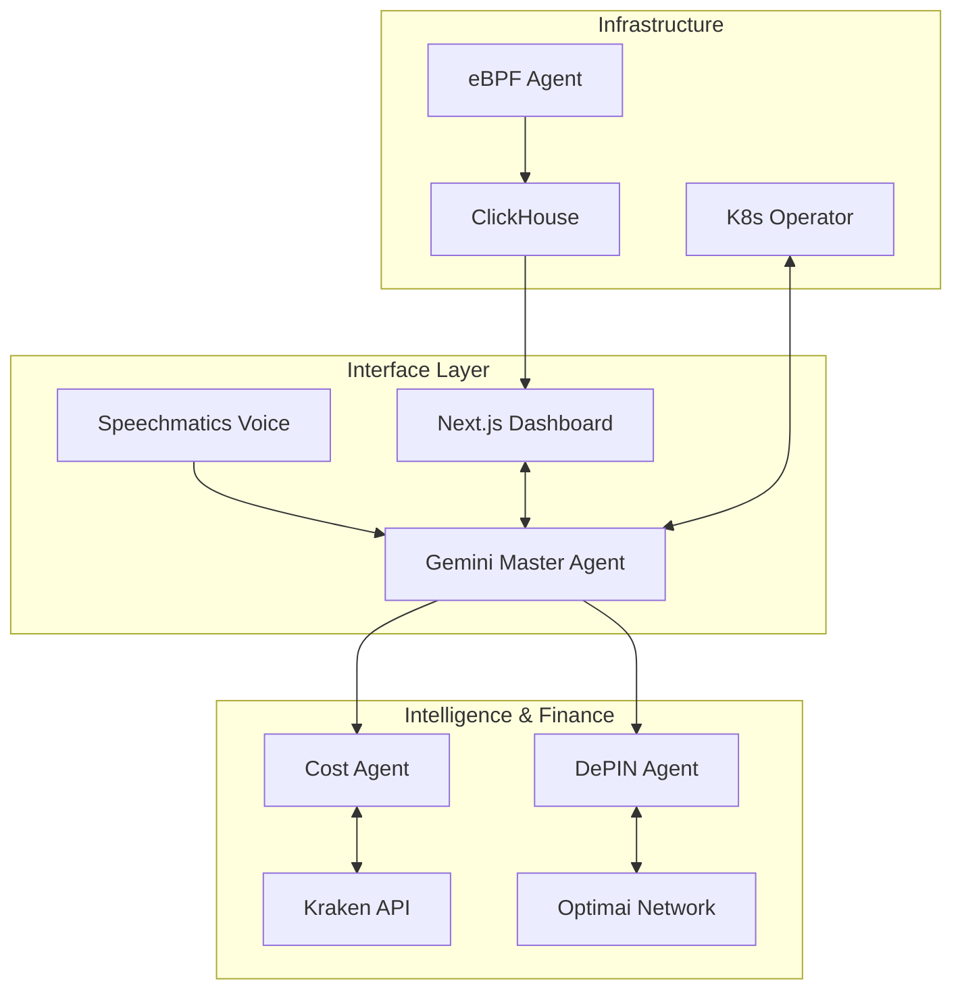

# 🛰️ Kraken Cloud Control (KCC)

### **The Sovereign Kubernetes AI Command Center & DePIN Hub**
*Professional Cluster Administration, Real-time Observation & Autonomous SRE*

<div align="center">

[](https://optimai.network)
[](https://www.speechmatics.com/)
[](https://deepmind.google/technologies/gemini/)
[](https://www.kraken.com/)
[](https://golang.org/)
[](https://nextjs.org/)


---

### 🌌 Platform Performance Matrix

| ⚡ Latency | 🛡️ Security | 🧠 AI Logic | 🌐 DePIN Rewards | 💵 FinOps |
|:---:|:---:|:---:|:---:|:---:|
| **< 0.8ms** | **Runtime eBPF** | **Gemini 1.5** | **4,490 OPTIM** | **$56.6K/mo Savings** |
| 🟢 Ultra-Low | 🟢 Hardened | 🟢 Multi-Agent | 🟢 2.5x Multiplier | 🟢 Enterprise Suite |

### 🚀 Visual Showcase
*Experience the future of Cloud Governance*


<p align="center"><i>Main Command Center: Real-time observability and multi-cluster health monitoring.</i></p>

<div align="center">
  
  
</div>
<p align="center"><i>Deep Resource Exploration: Advanced Pod and Node management with real-time status streams.</i></p>

<div align="center">
  
  
</div>
<p align="center"><i>High-Fidelity Analytics: CPU, Memory, and Network telemetry via gRPC streaming.</i></p>

<div align="center">
  
  
</div>
<p align="center"><i>Autonomous Intelligence: Gemini-powered insights and the industry's most advanced FinOps suite.</i></p>

<div align="center">
  
  
</div>
<p align="center"><i>Next-Gen Integration: Optimai DePIN rewards management and spatiotemporal resource heatmaps.</i></p>

---

</div>

## 🎯 Strategic Overview

**Kraken Cloud Control (KCC)** is an elite, sovereign platform designed for 2026-era Kubernetes infrastructure. It combines **eBPF-driven kernel observability** with **Gemini 1.5 Pro AI agents**, **Speechmatics real-time voice intelligence**, and seamless integration with the **Optimai DePIN Network**.

### 🌟 Elite Capabilities

*   **🗣️ Real-time Voice Intelligence**: Powered by **Speechmatics**, KCC understands natural language commands in real-time, allowing SREs to manage clusters hands-free.
*   **🌐 Optimai DePIN Integration**: Monetize your idle cluster resources. KCC connects directly to the **Optimai Network**, providing real-time reward tracking, wallet management, and resource contribution optimization.
*   **🛡️ Autonomous Cost Hedging**: Integrated with **Kraken**, automatically hedge against infrastructure price volatility with real-time market data.
*   **🧠 Multi-Agent AI Orchestration**: Specialized Gemini-powered agents (Maintenance, Security, Cost) coordinated by a Master SRE Agent.
*   **💰 Enterprise FinOps Suite**: 18+ advanced capabilities including ML-powered anomaly prediction, carbon tracking, and intelligent cost allocation.
*   **🗺️ Resource Heatmaps**: Visualize spatiotemporal distribution of load across your entire node fleet with interactive 24-hour heatmaps.

---

## ✨ Features & Upgrades

| Module | Capability | Tech Stack | Status |
|:---:|:---|:---|:---:|
| **DePIN Hub** | Optimai Network integration, Reward Staking, Wallet Analytics | Optimai SDK + Web3 | ✅ **STABLE** |
| **AI Assistant** | Real-time Voice Transcription & Command Execution | Speechmatics + Gemini | ✅ **STABLE** |
| **FinOps Suite** | 18+ Enterprise Capabilities ($56.6K/mo Savings) | Kraken + ML/AI | ✅ **ENHANCED** |
| **Observability** | Kernel-level Security & Performance Monitoring (eBPF) | eBPF + ClickHouse | ✅ **STABLE** |
| **Operator** | Autonomous Scale, Heal, and Policy Enforcement | Operator SDK | ✅ **STABLE** |
| **UI/UX** | Professional Cyberpunk-Theme Dashboard (v2.4.0) | Next.js + Tailwind + ECharts | ✅ **ENHANCED** |

---

## 🌐 The Optimai Network Integration

KCC is more than a management tool; it's a gateway to the **Optimai DePIN Network**. 

- **Passive Income**: Automatically contribute spare CPU/GPU cycles to the Optimai decentralized compute pool.
- **Real-time Monitoring**: Track your `OPTIM` rewards, multiplier status, and network contribution ranking directly from the KCC dashboard.
- **Auto-Staking**: Intelligent policies to auto-stake rewards for maximum yield based on cluster maintenance windows.
- **Future Integration**: Upcoming support for **Filecoin** and **Arweave** for decentralized log archiving and state preservation.

---

## 💰 Enterprise FinOps Suite

KCC features the most comprehensive FinOps platform available—surpassing commercial solutions costing $100K+ annually.

### 📊 Key Capabilities
- **ML-Powered Cost Anomaly Detection**: 95%+ accuracy, 4-hour advance warning.
- **Kraken Financial Intelligence**: Real-time hedging against cloud price volatility.
- **Carbon Footprint Tracking**: 26.5% YTD reduction via green region recommendations.
- **Intelligent Right-Sizing**: AI-driven optimization with one-click auto-apply.

---

## 🏗️ Architecture



---

## 🚀 Quick Start

### 1. Configure Credentials
```bash
export GEMINI_API_KEY="..."
export SPEECHMATICS_API_KEY="..."
export OPTIMAI_WALLET_ADDRESS="..."
```

### 2. Deploy Platform
```bash
kubectl apply -k infrastructure/manifests/base
```

### 3. Access Dashboard
```bash
kubectl port-forward svc/frontend 3000:80 -n kcc-system
```

---

## 🔮 Future Roadmap
- **Q3 2026**: Deep integration with **Vultr** for bare-metal DePIN orchestration.
- **Q4 2026**: Multi-agent collaborative debugging with automated PR generation.
- **2027**: Fully autonomous "Dark Clusters" – infrastructure that manages, heals, and pays for itself via DePIN rewards.

---

## 📄 License
MIT License. © 2026 Kraken Cloud Control Authors.

---

<div align="center">

**Built with ❤️ for the next generation of Kubernetes Engineers.**

[Website](https://kcc-platform.io) | [Documentation](https://docs.kcc-platform.io) | [Optimai Network](https://optimai.network)

</div>
