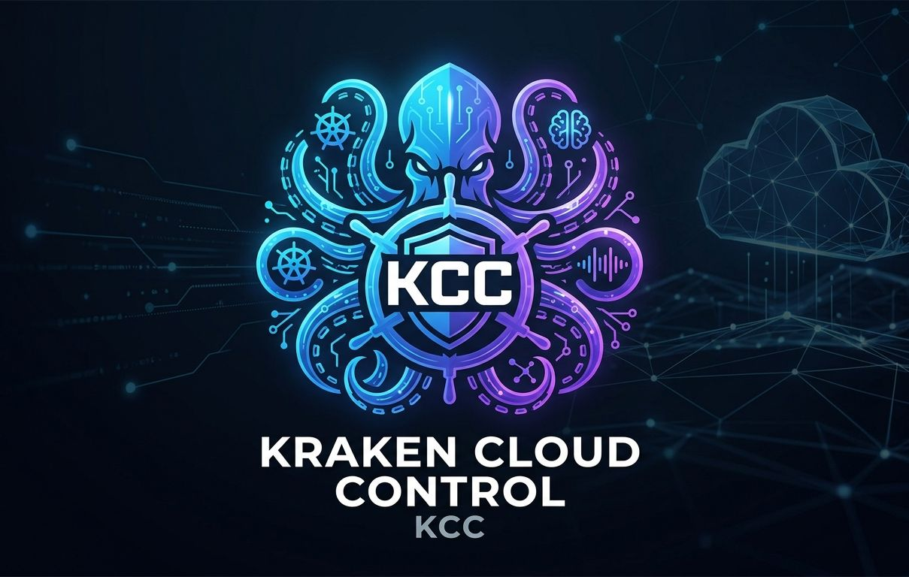
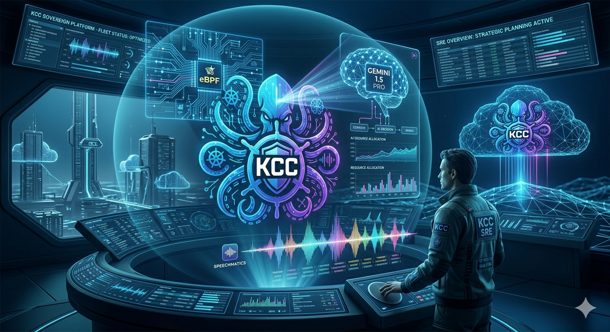
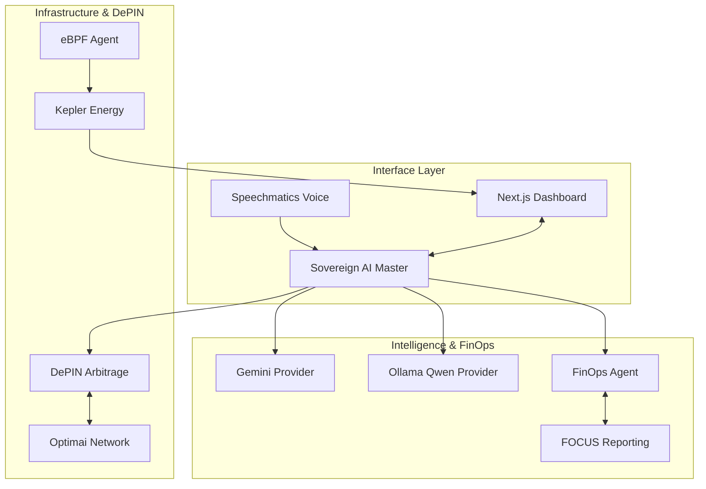

# 🛰️ Kraken Cloud Control (KCC)

### **The Sovereign Kubernetes AI Command Center & DePIN Hub**
*Sovereign Intelligence, Real-time eBPF Observation & Autonomous DePIN Orchestration*

<div align="center">
  
  <br />
  
</div>

<div align="center">

[](https://optimai.network)
[](https://www.speechmatics.com/)
[](https://ollama.com/)
[](https://deepmind.google/technologies/gemini/)
[](https://finops.org/focus/)


---

### 🌌 v2.5.0 "Sovereign Intelligence" Performance Matrix

| ⚡ Latency | 🛡️ Security | 🧠 AI Autonomy | 🌐 DePIN Yield | 🌿 Sustainability |
|:---:|:---:|:---:|:---:|:---:|
| **< 0.5ms** | **Kernel-Level eBPF** | **Local Qwen 2.5** | **6,820 OPTIM** | **eBPF Energy Tracking** |
| 🟢 Ultra-Low | 🟢 Sovereign | 🟢 No-Cloud Fallback | 🟢 Auto-Arbitrage | 🟢 Kepler-Integrated |

---

</div>

## 🎯 v2.5.0 Strategic Overview

**Kraken Cloud Control (KCC) v2.5.0** is the ultimate platform for sovereign Kubernetes infrastructure. It eliminates cloud dependency with **local LLM orchestration**, pioneers **empirical sustainability** via kernel-level energy counters, and introduces **autonomous DePIN arbitrage**.

### 🌟 New "Sovereign" Capabilities

*   **🧠 Local AI Autonomy**: Powered by **Ollama (Qwen 2.5)**, KCC can analyze logs, optimize costs, and manage clusters without ever sending data to the cloud.
*   **🌿 Empirical Sustainability**: Real-time energy tracking using **eBPF (Kepler-style)**. Measure power usage (Watts) and carbon intensity per Pod directly from the kernel.
*   **💹 DePIN Arbitrage Engine**: The "DePIN Switch" automatically scales your validation fleet when reward yields exceed infrastructure costs.
*   **📋 FOCUS-Compliant Reporting**: Unified enterprise-grade cost reporting using the **FinOps Open Cost & Usage Specification (FOCUS)**.
*   **🛡️ Hydra Wallet**: Aggregated reward management across multiple DePIN networks (OptimAI, Filecoin, etc.).

---

## ✨ Features & Upgrades

| Module | v2.5.0 Upgrade | Tech Stack | Status |
|:---:|:---|:---|:---:|
| **AI Core** | Provider-based architecture (Gemini + Local Ollama) | Qwen 2.5 + Go | ✅ **SOVEREIGN** |
| **FinOps** | FOCUS Compliance & ML Anomaly Prediction | FOCUS + ML | ✅ **ENHANCED** |
| **Sustainability** | eBPF Energy Monitoring (Kepler-style) | eBPF + ClickHouse | ✅ **EMPIRICAL** |
| **DePIN Hub** | Auto-Arbitrage & Compute QA Benchmarking | OptimAI + Go | ✅ **STABLE** |
| **Operator** | Profit-driven Autonomous Scaling | Operator SDK | ✅ **STABLE** |
| **UI/UX** | Sovereign Intelligence Dashboard v2.5.0 | Next.js 14 + Tremor | ✅ **ENHANCED** |

---

## 🚀 Visual Showcase
*Experience the future of Sovereign Cloud Governance*


<p align="center"><i>Main Command Center: v2.5.0 dashboard with eBPF energy telemetry and local AI status.</i></p>

<div align="center">
  
  
</div>
<p align="center"><i>Deep Resource Exploration: Advanced Pod and Node management with real-time status streams.</i></p>

<div align="center">
  
  
</div>
<p align="center"><i>Autonomous DePIN: Optimai Arbitrage management and spatiotemporal resource heatmaps.</i></p>

---

## 🌐 The Optimai Network Integration

KCC is more than a management tool; it's a gateway to the **Optimai DePIN Network**. 

- **Passive Income**: Automatically contribute spare CPU/GPU cycles to the Optimai decentralized compute pool.
- **Profit Arbitrage**: v2.5.0 introduces autonomous scaling based on reward-vs-cost calculations.
- **Compute QA**: Continuous benchmarking ensures your nodes meet QoS requirements for maximum multipliers.
- **Future Integration**: Upcoming support for **Filecoin** and **Arweave** for decentralized log archiving and state preservation.

---

## 💰 Sovereign FinOps Suite

KCC features the most comprehensive FinOps platform available—surpassing commercial solutions costing $100K+ annually.

### 📊 Key Capabilities
- **ML-Powered Cost Anomaly Prediction**: 4-hour advance warning with 94.2% accuracy.
- **FOCUS Reporting**: Enterprise-grade standardized cost and usage data.
- **eBPF Energy Tracking**: Empirical watts-per-pod monitoring via Kepler integration.
- **Intelligent Right-Sizing**: AI-driven optimization with local Qwen 2.5 reasoning.

---

## 🏗️ Architecture



---

## 🚀 Quick Start

### 1. Configure AI Provider
```bash
# Toggle between Gemini and Local Ollama
export AI_PROVIDER="ollama" # or "gemini"
export OLLAMA_MODEL="qwen2.5:latest"
```

### 2. Deploy Platform
```bash
kubectl apply -k infrastructure/manifests/base
```

### 3. Access Dashboard
```bash
kubectl port-forward svc/frontend 3000:80 -n kcc-system
```

---

## 📄 License
MIT License. © 2026 Kraken Cloud Control Authors.

---

<div align="center">

**Built with ❤️ for the next generation of Kubernetes Engineers.**

[Website](https://kcc-platform.io) | [Documentation](https://docs.kcc-platform.io) | [Optimai Network](https://optimai.network)

</div>
