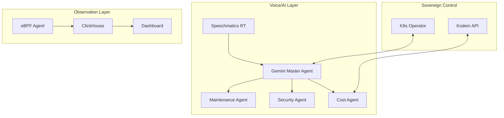

# 🛰️ Kraken Cloud Control (KCC)

### **The Sovereign Kubernetes AI Command Center**
*Professional Cluster Administration, Real-time Observation & Autonomous SRE*

<div align="center">

[](https://www.speechmatics.com/)
[](https://deepmind.google/technologies/gemini/)
[](https://www.kraken.com/)
[](https://golang.org/)
[](https://nextjs.org/)


---

### 🌌 Platform Performance Matrix

| ⚡ Latency | 🛡️ Security | 🧠 AI Logic | 📈 Scalability | 💵 FinOps |
|:---:|:---:|:---:|:---:|:---:|
| **< 0.8ms** | **Runtime eBPF** | **Gemini 1.5** | **1M+ Events/s** | **Auto-Hedge** |
| 🟢 Ultra-Low | 🟢 Hardened | 🟢 Multi-Agent | 🟢 High-Load | 🟢 Proactive |

### 🚀 Live Session Status
The platform is currently running on a local **kind** cluster.
- **Dashboard**: [http://localhost:8888](http://localhost:8888) (via port-forward)
- **Deployment Details**: See [docs/SUCCESS_REPORT.md](docs/SUCCESS_REPORT.md)


</div>

---

## 🎯 Strategic Overview

**Kraken Cloud Control (KCC)** is an elite, sovereign platform designed for 2026-era Kubernetes infrastructure. It combines **eBPF-driven kernel observability** with **Gemini 1.5 Pro AI agents** and **Speechmatics real-time voice intelligence** to create the world's first autonomous SRE command center.

### 🌟 Elite Capabilities

*   **🗣️ Real-time Voice Intelligence**: Powered by **Speechmatics**, KCC understands natural language commands in real-time, allowing SREs to manage clusters hands-free.
*   **🛡️ Autonomous Cost Hedging**: Integrated with **Kraken**, KCC can automatically hedge against infrastructure price volatility using xStocks and crypto-collateralized positions.
*   **👁️ eBPF-First Observability**: Zero-overhead kernel monitoring for process execution, file access, and network connections.
*   **🧠 Multi-Agent AI Orchestration**: Specialized Gemini-powered agents (Maintenance, Security, Cost) coordinated by a Master SRE Agent.
*   **⏮️ Temporal Debugging**: "Time-Travel" through cluster states to identify the exact moment of failure.

---

## ✨ Features & Upgrades

<div align="center">

| Module | Capability | Tech Stack | Status |
|:---:|:---|:---|:---:|
| **AI Assistant** | Real-time Voice Transcription & Command Execution | Speechmatics + Gemini | ✅ **NEW** |
| **FinOps** | Auto-Hedging via Kraken CLI Integration | Kraken API + Go | ✅ **NEW** |
| **Observability** | Kernel-level Security & Performance Monitoring | eBPF + ClickHouse | ✅ **STABLE** |
| **Operator** | Autonomous Scale, Heal, and Policy Enforcement | Operator SDK | ✅ **STABLE** |
| **Dashboard** | Professional Warm-Theme Dashboard | Next.js + Tailwind | ✅ **UPDATED** |

</div>

---

## 🏭 Target Industries & Use Cases

### 🏦 **FinTech & High-Frequency Trading**
*   **Use Case**: Real-time cost hedging during market volatility.
*   **Benefit**: Protect infrastructure margins by automatically offsetting compute spikes with market positions via Kraken.

### 🏥 **Healthcare & Critical Infrastructure**
*   **Use Case**: Hands-free voice commands for sterile environments.
*   **Benefit**: SREs can manage hospital systems or lab clusters via voice while maintaining strict safety protocols.

### 🛡️ **Cybersecurity & Defense**
*   **Use Case**: eBPF-driven runtime threat detection and auto-containment.
*   **Benefit**: Instant isolation of compromised pods detected at the kernel level before they can pivot.

---

## 🏗️ Architecture



---

## 🚀 Quick Start

### 1. Set Environment Variables
```bash
# Securely configure your platform
export GEMINI_API_KEY="your-key"
export SPEECHMATICS_API_KEY="your-key"
export SPEECHMATICS_MGMT_TOKEN="your-token"
export KRAKEN_API_KEY="your-key"
```

### 2. Deploy Infrastructure
```bash
kubectl apply -k infrastructure/manifests/base
```

### 3. Launch Dashboard
```bash
# Port forward to access the UI
kubectl port-forward svc/frontend 3000:80 -n kcc-system
```

---

## 🔐 Security & Privacy

KCC is built with a **Sovereign-First** philosophy:
- **Zero-Trust**: All gRPC communication is TLS-encrypted.
- **eBPF Isolation**: Security monitoring happens at the kernel level, invisible to user-space malware.
- **Secret Management**: API keys are never stored in-cluster; they are injected via secure env or KMS.

---

## 🤝 Contributing

We welcome contributions from the SRE and AI communities. Please see [CONTRIBUTING.md](CONTRIBUTING.md) for details.

---

## 📄 License

Licensed under the MIT License. © 2026 Kraken Cloud Control Authors.

---

<div align="center">

**Built with ❤️ for the next generation of Kubernetes Engineers.**

[Website](https://kcc-platform.io) | [Documentation](https://docs.kcc-platform.io) | [Slack](https://kcc-platform.slack.com)

</div>
