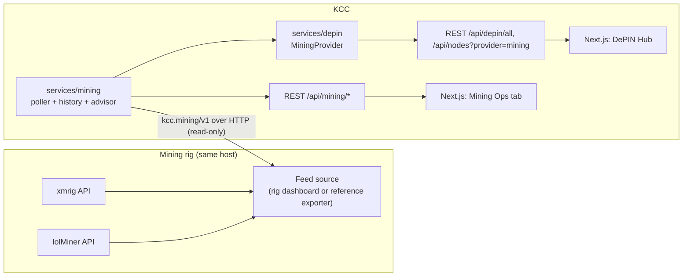

# KCC Technical Guide: Standalone Mode and Mining Integration

This guide is for developers. It covers the architecture, configuration, REST endpoints and the `kcc.mining/v1` feed contract added in v2.6.0. For setup steps, see [USER_GUIDE.md](USER_GUIDE.md).

## Architecture



Design rules:

- **Read-only.** KCC observes the rig. Miner control stays on the rig, so a compromised dashboard can't redirect hashpower or payouts.
- **No secrets in the feed.** The schema has no fields for wallet addresses, worker passwords or tokens. Producers must strip them, for example by reducing a pool URL to `host:port`.
- **Loopback by default.** The standalone units bind KCC to `127.0.0.1`, and CORS is an allow-list.

## Configuration (environment)

| Variable | Default | Purpose |
|---|---|---|
| `KCC_HTTP_ADDR` | `:8080` | REST listen address (`127.0.0.1:8080` in standalone units) |
| `KCC_GRPC_HOST` | *(all interfaces)* | gRPC bind host; the port is `PORT` (default `50051`) |
| `KCC_CORS_ORIGINS` | `*` | Comma-separated allowed origins for the REST API |
| `KCC_REQUIRE_CLUSTER` | unset | `1` = exit if no kubeconfig instead of running standalone |
| `KCC_MINING_URL` | `http://127.0.0.1:8420/api/kcc/v1` | Feed URL, or `off` to disable |
| `KCC_MINING_POLL` | `10s` | Poll interval (min 2 s); history keeps 2160 samples (6 h at 10 s) |
| `OPTIMAI_ACCOUNT`, `OPTIMAI_RPC_URL` | unset | OptimAI provider identity (previously hard-coded) |
| `NEXT_PUBLIC_KCC_API` | `http://localhost:8080` | Dashboard → backend base URL (build time) |
| `NEXT_PUBLIC_RIG_DASHBOARD` | `http://127.0.0.1:8420` | "Open rig dashboard" link (build time) |

## Standalone mode

`cmd/server/main.go` tries in-cluster config, then `$KUBECONFIG` / `~/.kube/config`. On failure it continues with a `nil` clientset:

- `cluster.Service` methods return `cluster.ErrNoCluster`.
- `OptimAIProvider` lifecycle methods return `depin.ErrNoCluster`. Its metrics are unaffected.
- `observation.StreamEvents` closes its channel immediately.
- `/api/metrics` includes `"mode": "standalone"`.

## REST endpoints added

| Method & path | Returns |
|---|---|
| `GET /api/mode` | `{"mode": "cluster"\|"standalone", "mining": bool}` |
| `GET /api/mining/summary` | `Summary`: `connected`, `error`, `source`, `fetched_at`, `feed` (the last `kcc.mining/v1` doc), `totals`, `advice[]` |
| `GET /api/mining/history?since=<unix>` | `[{ts, watts, hashrates{minerId: rate}, temps{device: °C}}]` |
| `GET /api/mining/focus` | FOCUS cost rows, one per enabled miner (estimated per night) |
| `GET /api/nodes?provider=mining` | Miners as DePIN `NodeInfo` (the `provider` query works for all providers; default `optimai`) |
| `GET /api/depin/all` | Now includes `"mining"` |

`totals` fields: `active_miners`, `enabled_miners`, `hashrate_by_unit{unit: sum}`, `balance_by_coin`, `balance_usd`, `cost_per_hour_usd`, `reject_rate_pct`, `payout_progress_pct`.

## `kcc.mining/v1` schema

The producer serves this document with `GET` and `Content-Type: application/json`. Unknown fields are ignored. Nullable fields may be `null` when a value is unknown.

```jsonc
{
  "schema": "kcc.mining/v1",          // required; must start with "kcc.mining/v1"
  "ts": 1791077495.9,                 // unix seconds when produced
  "source": "my-exporter",
  "mining": true,                     // any miner running
  "window": {"start_hour": 23, "stop_hour": 7},   // optional schedule
  "cpu_mode": "tari",                 // optional free text
  "tari_only": true,                  // all enabled miners target one coin
  "nodes_paused": true,               // blockchain nodes stopped while mining
  "miners": [{
    "id": "xmrig", "device": "CPU", "algo": "RandomX", "coin": "XTM",
    "unit": "H/s",                    // "H/s", "g/s", ...: totals are summed per unit
    "enabled": true, "active": true,
    "hashrate": 4012.5,               // live, nullable
    "expected_hashrate": 4000,        // baseline for the "below baseline" rule
    "accepted": 120, "rejected": 1,   // nullable
    "pool": "pool.example:7038",      // host:port only, never credentials
    "temp_c": 71, "watts": 95,        // nullable
    "coins_per_night": 30.2
  }],
  "power": {"watts_live": 410, "watts_mining_estimate": 400, "usd_per_kwh": 0.17},
  "economics": {
    "hours_per_night": 8, "xtm_per_night": 60.1,
    "revenue_usd_night": 0.25, "power_cost_usd_night": 0.54, "net_usd_night": -0.29,
    "nights_to_payout": 3.1, "payout_threshold_xtm": 200
  },
  "balances": [{"id": "pool-cpu", "label": "Tari · CPU pool", "coin": "XTM",
                "confirmed": 12.4, "pending": 3.1, "paid": 0, "threshold": 200}],
  "prices": {"XTM": {"usd": 0.0042, "ch_24h": -1.2}},
  "health": [{"name": "CPU temperature", "status": "good", "detail": "71°C"}],  // good|warn|crit|idle
  "nodes": {}                          // free-form node sync info
}
```

### Producers

- **Reference exporter:** `integrations/mining-exporter/kcc_mining_exporter.py`. It uses only the standard library and reads xmrig `/2/summary` and the lolMiner API. It doesn't know pool balances or prices, so those fields are empty.
- **Custom rig dashboards:** add an endpoint that maps your state to the schema. Strip wallet addresses from pool strings and leave `balances[]` without addresses.

## Advisor rules (`services/mining/advisor.go`)

| Rule | Severity |
|---|---|
| Feed stale (no successful poll in 3 intervals) | warn |
| Rig health check is `crit` | crit |
| Enabled miner not running while rig mines | warn |
| Live hashrate < 75% of `expected_hashrate` | warn |
| Device ≥ 80 °C | warn |
| Share reject rate > 5% | warn |
| Revenue < power cost / profitable | info |
| Nights to pool payout | info |
| Idle inside the mining window | warn |
| Enabled miners target more than one coin | info |

Rules are deterministic and cheap, and the advisor never calls an LLM. Running LLM inference on a GPU-mining rig evicts the miner from VRAM. Any future AI-generated advice should be explicit and opt-in.

## Security notes

- The REST API has no authentication. Keep `KCC_HTTP_ADDR` on loopback, or put an authenticating reverse proxy in front.
- The feed is pulled by the backend (server to server), so the rig's endpoint doesn't need CORS. Keep it on loopback too.
- Configuration with secrets lives in `~/.config/kcc/kcc.env` (mode `600`). `.gitignore` excludes `.env*` files.

## Files

```
backend/services/mining/        types.go, service.go (poller/history/totals), advisor.go, focus.go
backend/services/depin/mining.go MiningProvider (read-only DePIN adapter)
backend/cmd/server/main.go      standalone mode, /api/mining/*, /api/mode, CORS allow-list
frontend/components/dashboard/mining-operations.tsx   Mining Ops tab
frontend/lib/utils.ts           KCC_API base URL
deploy/standalone/              systemd user units, env example, install.sh
integrations/mining-exporter/   reference kcc.mining/v1 exporter
```
